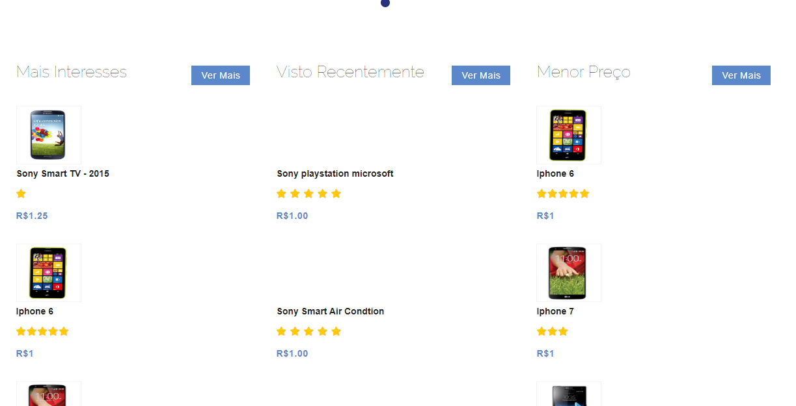
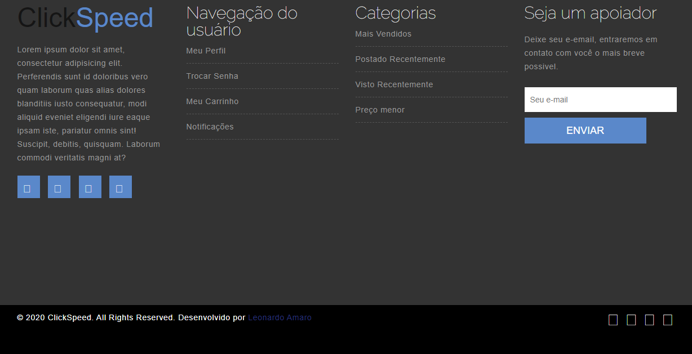
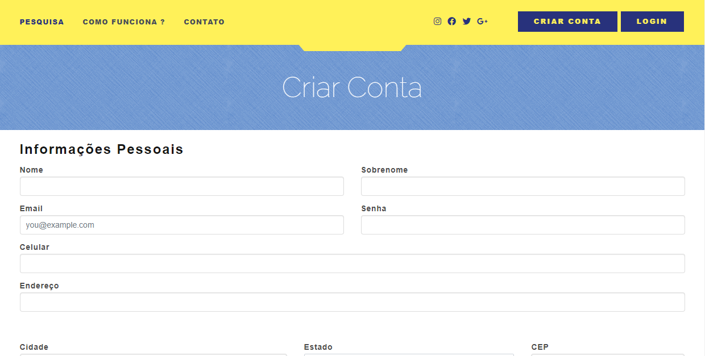
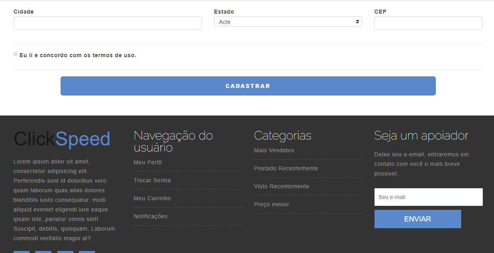
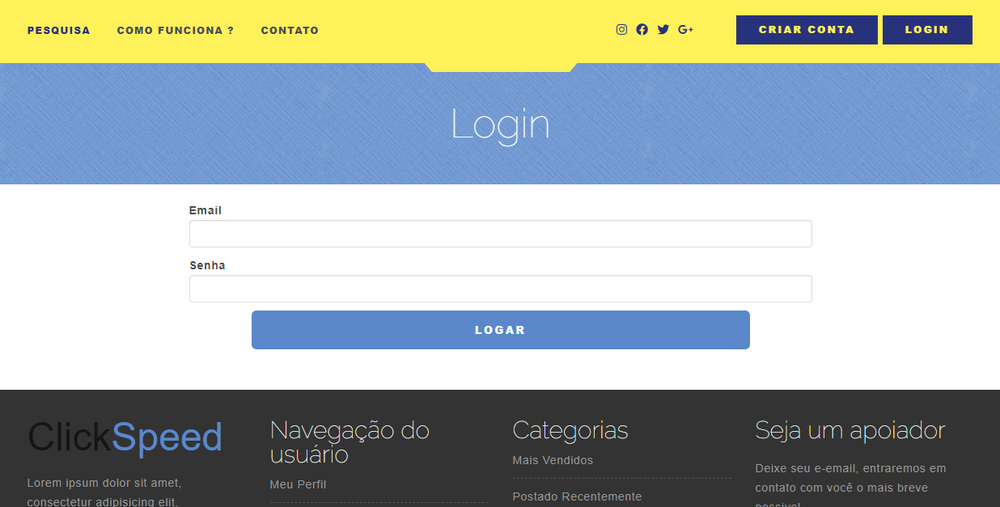
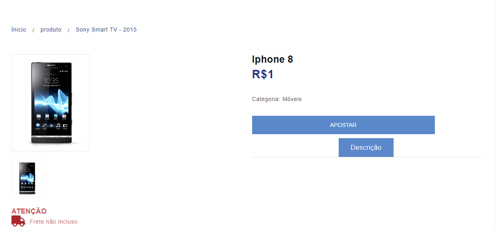

# ecommerce-betting system
 It is an electronic commerce system with integration of a betting system, so each user can bet on some product. A timer will be released by the administrator when the product reaches a certain number of purchases. The first user clicks the button to get the product, while the other users lose, they just bet, the project is not completely finalized, but most of the functions are completed: login, product preview, product purchase, product management and timer management, a connection to mysql data, was used in PHP 7.3.12.
 
 ## Index Interface Web System
 
The index has a slide for production information purposes, it also has a carousel with the products, and also separated in order of the best sellers, products with the lowest price and those recently seen by the user.

Screenshots:

 ## Registration System + Login System
 
The registration system validates all fields against xss attacks and invalid characters, validates email fields, the password and is sent encrypted to the database with the password_hash () function. After registration there is a validation with a crytogrado code that is sent in the email via the user's php mailer method, the link to the validation.

Screenshots:

 ## Product display and stopwatch
The visualization of the product is simple, only the image of the product, the title, description and category, the customer's purchasing part works with a carousel, when the chronometer released the first to click on the button will be the buyer of the product.
 
 Screenshots:

# TUTORIAL
1 ° Import the _config.sql file to your database
2 ° Configure your data for access to the database located in the /_mysql/conn.php folder
3 ° Extract the project to your server
 
 ###### Credits
 José Rodrigues,
 Vector,
 Ustora,
 Leonardo Amaro
 
